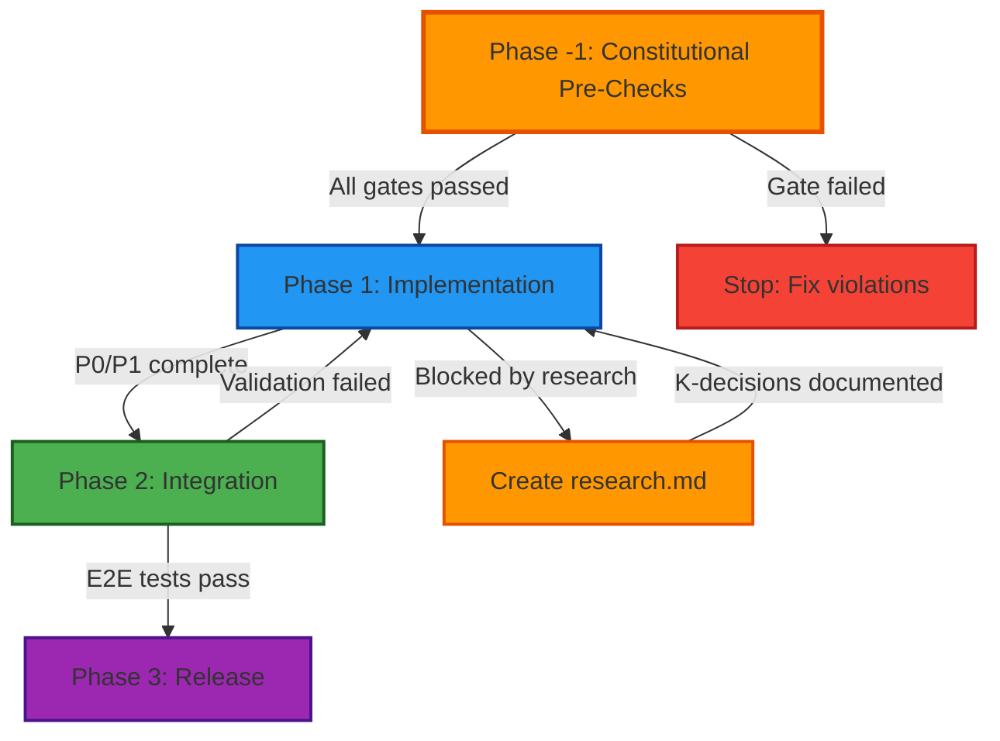

# Spec-Driven Development with GitHub Spec-Kit

## 30-Minute Corporate Presentation Plan (Production-Ready)

**Target Audience**: IT specialists with intermediate AI coding experience (Copilot/Claude/Cursor users)

**Duration**: 30 minutes (25 min presentation + 5 min Q&A)

**Format**: Google Slides (hybrid: slides + screenshots + selective live demo)

**Credibility Strategy**: Use real-world production examples (JetBrains IdeaVim, Skyscanner Backpack, Manifest CLI)

---

## Presentation Objectives

By the end of this presentation, attendees will:

1. **Understand** the core principles of Spec-Driven Development (SDD)
2. **Recognize** how GitHub Spec-Kit operationalizes SDD in real projects
3. **Identify** when to use Spec-Kit artifacts (spec.md, plan.md, tasks.md, research.md)
4. **Apply** constitution versioning concepts to their own projects
5. **Walk away** with concrete next steps to try Spec-Kit on Monday morning

---

## Slide Deck Structure (25 minutes + 5 min Q&A)

### Section 1: The Problem & The Solution (5 minutes, Slides 1-6)

#### Slide 1: Title Slide

**Content**:
- Title: "Spec-Driven Development with GitHub Spec-Kit"
- Subtitle: "From Idea to Production with AI-Assisted Workflows"
- Presenter name, title, date
- Visual: Split-screen showing chaos (messy chat) → order (clean spec.md)

**Speaker Notes (Brief)**:
- "Today we're solving a problem every team faces: how do we keep AI agents aligned with our vision when building complex features?"

---

#### Slide 2: The Problem (Current State)

**Content**:
- Title: "The AI Agent Problem"
- Diagram/Textual Description: Conversation Timeline showing context degradation
  - Messages 1-10: Clear decisions ("Let's use PostgreSQL with JWT auth")
  - Messages 20-30: Agent asks "What database should we use?" (already decided)
  - Messages 40-50: Agent suggests incompatible approach, contradicts earlier decisions
- Key Problems to Highlight:
  1. **Context Loss**: Agent forgets decisions made 20 messages ago
  2. **Redundant Questions**: Agent re-asks about testing strategy, database choice, API structure
  3. **Implementation Drift**: Final code doesn't match original requirements
  4. **No Shared Memory**: New session = start from zero
  5. **Expensive Rework**: 10+ hours wasted on misaligned implementation

**Real-World Example** (anonymized):
```
Message 15: "Let's use REST API with pagination"
Message 48: Agent suggests GraphQL implementation
Developer: "Wait, didn't we decide on REST?"
Agent: "I don't have record of that decision"
```

**Speaker Notes (Detailed)**:
- "Raise your hand if you've had a 50-message AI chat where the agent 'forgets' what you decided 20 messages ago."
- "The problem: AI agents are stateless. Every new session starts from zero."
- **Real-world hook**: "At JetBrains, they were building an API for their IdeaVim plugin with 10,000+ GitHub stars. Without structure, even skilled engineers had trouble keeping external plugin developers aligned with internal refactoring."

---

#### Slide 3: Traditional Approaches Fall Short

**Content**:
- Title: "Why Traditional Methods Don't Work"
- Comparison table (2 columns, 3 rows):

  | Approach | Problem |
  |----------|---------|
  | Pure chat | Context loss, no memory |
  | Waterfall docs | Too rigid, disconnected from code |
  | Agile stories | Too granular, missing architecture |

- Visual: Three icons with X marks

**Speaker Notes (Brief)**:
- "You might think: 'We already have documentation.' But ask yourself:"
- "When did your agent last **read** your architecture docs before suggesting code?"
- "When did your Jira tickets prevent an AI from recommending the wrong database?"
- "We need something AI-native."

---

#### Slide 4: Introducing Spec-Driven Development

**Content**:
- Title: "Spec-Driven Development (SDD)"
- Definition box: "A methodology where AI agents and humans collaborate through **structured artifacts** that capture WHAT, WHY, and HOW."
- 3 core principles (icons + text):
  - 📋 **Specs before code** (WHAT & WHY)
  - 🏗️ **Plans before implementation** (HOW)
  - ✅ **Tasks with acceptance criteria** (executable steps)

**Speaker Notes (Brief)**:
- "SDD flips the script: instead of asking the AI 'build me a feature,' you co-create a spec, then a plan, then tasks."
- "Think of it as TDD (Test-Driven Development) but for requirements."
- "The artifacts become the shared memory between you, your team, and your AI agents."

---

#### Slide 5: Enter GitHub Spec-Kit

**Content**:
- Title: "GitHub Spec-Kit: SDD Made Real"
- Subtitle: "Open-source framework from GitHub (2024)"

**What is Spec-Kit**:
- Open-source framework operationalizing Spec-Driven Development methodology
- Provides CLI + slash commands for AI coding assistants
- Used in production: JetBrains IdeaVim, Skyscanner Backpack, internal CLI tools

**System Requirements**:
- Python 3.11+ (required for CLI)
- Git (for branch management)
- AI coding assistant: GitHub Copilot, Claude, or Cursor
- Optional: `uv` tool installer (recommended) or `pip`

**Installation Command**:
```bash
# Option 1: Using uv (recommended)
uv tool install specify-cli --from git+https://github.com/github/spec-kit.git

# Option 2: Using pip
pip install git+https://github.com/github/spec-kit.git

# Verify installation
specify --version
```

**Initial Setup**:
```bash
# Initialize in existing project
cd your-project/
specify init --here --ai claude

# Or create new project
mkdir new-project && cd new-project
specify init --ai copilot
```

**What Gets Created**:
- `.specify/` directory (artifact storage)
- `.specify/templates/` (spec, plan, task templates)
- Configuration file: `.specify/config.yaml`

**Quick Start**:
```bash
# Create first specification
specify create spec "Add user authentication"

# Or use slash command in AI chat
/speckit.specify Add user authentication with JWT tokens
```

**Speaker Notes (Brief)**:
- "Spec-Kit is GitHub's answer to 'how do we make SDD practical?'"
- **Credibility anchor**: "It's not a toy. JetBrains uses it for IdeaVim. Skyscanner uses it for Backpack, their design system with 95+ component packages."
- "Installation takes 2 minutes. Let's see what you get."

---

#### Slide 6: The Spec-Kit Workflow (Visual)

**Content**:
- Title: "The 6-Step Spec-Kit Workflow"
- Visual: Flowchart with 6 boxes + icons:
  1. `/speckit.constitution` → constitution.md
  2. `/speckit.specify` → spec.md
  3. `/speckit.clarify` → (optional research.md)
  4. `/speckit.plan` → plan.md
  5. `/speckit.analyze` → validation
  6. `/speckit.tasks` → tasks.md
- Color coding: Green (setup), Blue (specification), Orange (planning), Purple (execution)

**Speaker Notes (Brief)**:
- "Six steps. But don't worry—we'll focus on the four artifacts that matter most."
- "Constitution sets the rules once. Then every feature follows: specify → plan → tasks."
- "Let's see what these artifacts actually look like in production."

---

### Section 2: The Core Artifacts (12 minutes, Slides 7-16)

#### Slide 7: Section Title

**Content**:
- Large text: "The Four Artifacts"
- Subtitle: "Real examples from production projects"
- Visual: 4 document icons (constitution, spec, plan, tasks)

**Speaker Notes (Brief)**: 
- (Breather slide - minimal speaking)

---

#### Slide 8: Artifact #1 – constitution.md

**Content**:
- Title: "constitution.md: Your Project's Immutable Laws"

**What IS a Constitution**:
- **Project's foundational rules** that govern ALL development work
- **Created once** at project inception, then versioned (semver: 1.0.0 → 1.0.1 → 2.0.0)
- **Referenced by all artifacts** via `sync_impact` field to track alignment
- **Enforced** through templates, Phase -1 gates, and CI/CD checks

**What to Include - Core Articles** (typically Article I-V):

**Article I: Non-Negotiable Rules**
- Legal requirements (licenses, copyright headers)
- Security mandates (dependency scanning, credential handling)
- Tooling constraints (specific CI/CD, required linters)
- Example: "Apache 2.0 license headers REQUIRED in all source files"

**Article II: Testing Standards**
- Unit test coverage thresholds (e.g., "80% minimum")
- Integration test requirements
- Test-first vs test-after policies
- Example: "P1 features MUST have unit tests before PR approval"

**Article III: Code Organization**
- Directory structure conventions
- Module/package naming patterns
- Architectural boundaries (e.g., "API layer must not import implementation details")
- Example: "All public APIs in `src/api/`, internals in `src/internal/`"

**Article IV: Documentation Standards**
- README requirements (badges, setup instructions)
- API documentation format (JSDoc, docstrings)
- Changelog maintenance (Keep a Changelog format)
- Example: "All public functions MUST have docstrings with param types"

**Article V: Dependency Management**
- Approved dependency sources (npm registry, private registry)
- Version pinning policies (exact vs caret)
- Security update cadence
- Example: "Lock files MUST be committed; no floating versions in production"

**What NOT to Include**:
- ❌ **Implementation details**: "Use React hooks" (belongs in plan.md)
- ❌ **Feature-specific requirements**: "Login page must have email field" (belongs in spec.md)
- ❌ **Temporary decisions**: "Use mock API for now" (belongs in research.md)
- ❌ **Personal preferences**: "I prefer tabs over spaces" (team discussion, not constitution)

**Additional Articles (Article X+)** - When to Add:
- Project grows from POC → MVP → Production
- New compliance requirements emerge (SOC2, HIPAA)
- Team expands and needs process clarity

**Common Additional Articles**:

**Article VI: Security Standards**
- Secrets MUST NOT be committed to repo
- All API endpoints MUST validate input
- Authentication required for non-public routes
- Regular dependency audits (monthly)

**Article VII: Performance Requirements**
- Page load time < 3 seconds (desktop)
- API response time < 200ms (95th percentile)
- Bundle size < 500KB (initial load)
- Core Web Vitals: LCP < 2.5s, FID < 100ms, CLS < 0.1

**Article VIII: Accessibility Standards**
- WCAG 2.1 AA compliance REQUIRED
- All interactive elements keyboard navigable
- Color contrast ratio ≥ 4.5:1 for text
- Screen reader tested before production

**Article IX: Deployment & Release**
- Main branch ALWAYS deployable
- Feature flags for incomplete features
- Rollback plan documented for all releases
- Blue-green deployment for production

**Article X: Monitoring & Observability**
- Error tracking configured (Sentry, Rollbar)
- Logging standards (structured JSON logs)
- Metrics dashboards for critical paths
- On-call runbooks for each service

**Version Semantics**:

**PATCH** (1.0.0 → 1.0.1):
- Typo fixes, clarifications
- Template improvements (formatting)
- No rule changes
- **Action**: Optional regeneration

**MINOR** (1.0.x → 1.1.0):
- New articles added (Article VI, VII)
- New NON-NEGOTIABLE rules
- Stricter enforcement of existing rules
- **Action**: Review in-flight work; regen if affected

**MAJOR** (1.x.x → 2.0.0):
- Rules removed or fundamentally changed
- POC → Production transition (remove DEFERRED markers)
- Breaking changes to enforcement
- **Action**: MUST regenerate all in-flight specs/plans/tasks

**Example: Backpack Constitution**:
```yaml
---
version: 1.0.2
previous_version: 1.0.1
---

# Article I: NON-NEGOTIABLE - Apache 2.0 License
All source files MUST include Apache 2.0 header.
CI fails if header missing.

# Article II: NON-NEGOTIABLE - Nx Workspace Structure  
All components organized under libs/ by domain.
No flat packages/ structure.

# Article III: Component Testing
Each component MUST have:
- Unit tests (Jest)
- Visual regression tests (Chromatic)
- Accessibility tests (axe-core)
```

**Example: Manifest Constitution Evolution**:
```yaml
# v1.1.0 (POC Phase)
[DEFERRED FOR POC] Testing requirements
[DEFERRED FOR POC] Performance optimization

# v2.0.0 (Production Ready) - MAJOR BUMP
✅ Article IV: Testing REQUIRED
✅ Article V: Performance metrics enforced
✅ Article VI: Security standards added
```

**Speaker Notes (Detailed)**:
- "Think of this as your project's founding document."
- **Real example**: "Skyscanner's Backpack constitution has NON-NEGOTIABLE markers for Apache 2.0 license headers. If you forget one, CI fails. No exceptions."
- "Constitutions evolve: PATCH for typos, MINOR for new guidelines, MAJOR when POC becomes production."
- **Visual cue**: "Notice the version 1.0.2 and the SYNC IMPACT report—we'll come back to this."

---

#### Slide 9: Constitution Evolution (Real Example)

**Content**:
- Title: "Constitution Evolution: POC → Production"
- Side-by-side comparison (2 columns):

  | Manifest v1.1.0 (POC) | Manifest v2.0.0 (MVP) |
  |-----------------------|-----------------------|
  | [DEFERRED FOR POC] Testing | ✅ Tests REQUIRED |
  | [DEFERRED FOR POC] Performance | ✅ Perf metrics enforced |
  | Security: Not mentioned | ✅ Article VI: Security Standards |

- Visual: Arrow showing version jump 1.1.0 → 2.0.0

**Speaker Notes (Detailed)**:
- "This is from a real CLI tool project. Started as POC, grew to production."
- **Key lesson**: "You can start minimal. But when you remove 'DEFERRED' markers, that's a MAJOR version bump—existing branches need to regenerate plan/tasks."
- "The `sync_impact` field in your spec.md says 'I was written against constitution v1.1.0.' If constitution is now 2.0.0, you know you're out of date."
- **Takeaway**: "Versioning prevents silent drift between your rules and your work."

---

#### Slide 10: Artifact #2 – spec.md

**Content**:
- Title: "spec.md: The WHAT and WHY"

**Purpose of spec.md**:
- Captures **WHAT** needs to be built and **WHY** it matters
- Does **NOT** prescribe **HOW** to implement (that's plan.md's job)
- Single source of truth for requirements
- Readable by both humans and AI agents

**Required Elements for Complete Spec**:

**1. Frontmatter (Metadata)**
```yaml
---
feature_name: "User Authentication System"
branch_id: "branch-042-auth"
complexity: High
effort: Large (2-3 weeks)
status: approved
sync_impact: 1.2.2  # Constitution version alignment
companion_research: research-042-auth.md  # If complex
---
```

Required Fields:
- `feature_name`: Clear, concise (≤60 chars)
- `complexity`: Low/Medium/High (technical difficulty)
- `effort`: Small/Medium/Large with time estimate
- `sync_impact`: Constitution version spec was created against
- `status`: draft/needs_clarification/approved/implemented

**2. Context & Motivation** (The WHY):
Must Answer:
- **Business problem**: What pain point are we solving?
- **User impact**: Who benefits and how?
- **Strategic alignment**: How does this fit roadmap/goals?
- **Success criteria**: What does "done" look like?

Example:
```
## Context
External plugin developers currently depend on IdeaVim's internal 
implementation classes. This creates fragility - every internal 
refactoring risks breaking plugins. 10+ plugins affected, 50+ 
GitHub issues about API instability.

## Motivation  
Create stable API boundary so:
- Internal refactoring doesn't break plugins
- Plugin developers have clear contract
- IdeaVim can evolve without backward compat burden
```

**3. User Stories with Acceptance Criteria**:

Format:
```
### User Story 1 [Priority: P1]
**As a** [persona]
**I want** [capability]
**So that** [business value]

**Acceptance Criteria**:
- [ ] Given [context], when [action], then [outcome]
- [ ] Given [context], when [action], then [outcome]

**Out of Scope**:
- [Explicitly list what's NOT included]
```

Requirements:
- Minimum 3 user stories (unless trivial feature)
- Prioritize: P0 (critical), P1 (high), P2 (nice-to-have)
- Acceptance criteria MUST be testable/verifiable
- Define "out of scope" explicitly (prevents scope creep)

**4. Functional Requirements**:
```
### FR-1: [Capability Name]
**Description**: Clear statement of what system must do
**Rationale**: Why this is necessary
**Dependencies**: Other FRs, K-decisions, or external factors
```

**5. Non-Functional Requirements (NFRs)**:
Categories:
- **Performance**: Response time, throughput, resource usage
- **Scalability**: User load, data volume limits
- **Security**: Auth, encryption, input validation
- **Reliability**: Uptime, error rates, recovery
- **Maintainability**: Code quality, documentation
- **Usability**: Accessibility, error messages, learnability

**6. Constraints**:
```
## In Scope
- API module for core editor operations
- Migration guide for plugin developers
- Deprecation notices for old patterns

## Out of Scope (Explicitly)
- UI/UX changes (no user-visible impact)
- Plugin discovery/marketplace integration
- Automated migration tooling (manual migration acceptable)
```

**7. Success Metrics**:
```
## Success Criteria
- 10+ plugins migrated to new API within 3 months
- Zero internal refactoring blocked by external deps (post-migration)
- API stability: no breaking changes for 6+ months
- Plugin developer satisfaction: ≥4/5 in post-migration survey
```

**8. Open Questions / Needs Clarification**:
```
## Open Questions
- [NEEDS CLARIFICATION] Should API support async operations?
- [NEEDS CLARIFICATION] How to handle plugin version compatibility?

**Clarification Session 1** (2026-02-10):
Q: Async support?
A: Deferred to v2. Start with synchronous API.
```

**Spec Quality Checklist**:

A good spec.md MUST have:
- ✅ Clear problem statement (WHY)
- ✅ 3+ prioritized user stories with testable acceptance criteria
- ✅ Explicit out-of-scope items
- ✅ Functional requirements with dependencies
- ✅ Non-functional requirements (performance, security, etc.)
- ✅ Success metrics (quantifiable)
- ✅ Constitutional alignment (sync_impact field)

A good spec.md MUST NOT have:
- ❌ Implementation details ("use React hooks")
- ❌ Technology choices ("PostgreSQL database")
- ❌ File structure ("create src/api/auth.ts")
- ❌ Task breakdowns ("Step 1: Create schema")

**When to Create Companion research.md**:
- Multiple architectural approaches exist
- Complex trade-offs need documentation
- Platform constraints require investigation
- Decision rationale needs preservation

**Spec Complexity Examples**:

| Aspect | Simple (Taskify) | Complex (IdeaVim API) |
|--------|------------------|----------------------|
| **Lines** | 158 | 249 |
| **User Stories** | 5 (straightforward) | 10 (prioritized P0/P1/P2) |
| **Personas** | 1 (developer) | 3 (core dev, plugin dev, user) |
| **Acceptance** | Simple checklists | Given/When/Then scenarios |
| **NFRs** | Minimal (basic perf) | Extensive (compat, docs, perf) |
| **Research** | None needed | 418 lines (K1-K6 decisions) |
| **Effort** | Small (2-3 days) | Large (4-6 weeks) |

**Speaker Notes (Detailed)**:
- "Every feature starts with a spec. But specs scale."
- **Simple example**: "Taskify spec: 158 lines, 5 user stories, clear persona. Fits a 2-day feature."
- **Complex example**: "IdeaVim API spec: 249 lines, prioritized stories (P1, P2, P3), Given/When/Then scenarios. Multi-month refactoring affecting external plugin developers."
- "Both follow the same structure. The framework adapts to your complexity."

---

#### Slide 11: spec.md in Action (Real Example)

**Content**:
- Title: "Real Spec: IdeaVim API Layer - Unique Features"

**Project Context**:
- **Project**: JetBrains IdeaVim (10,000+ GitHub stars)
- **Context**: Refactoring plugin API to separate internal/external boundaries
- **Spec**: `artifacts/spec-example-ideavim-api.md` (249 lines)

**Unique Feature #1: Multi-Stakeholder Personas**

Most specs have 1-2 personas. IdeaVim has **3 distinct personas**:

```
**Persona 1: IdeaVim Core Developer**
- Needs: Refactor internals without breaking plugins
- Pain: Current tight coupling blocks improvements
- Value: Freedom to evolve architecture

**Persona 2: External Plugin Developer**  
- Needs: Stable API contract
- Pain: Internal changes frequently break plugins
- Value: Predictable dependency, clear docs

**Persona 3: IdeaVim End User**
- Needs: Plugin ecosystem continues working
- Pain: Plugins break after IdeaVim updates
- Value: Stable experience, rich plugin choice
```

**Lesson**: Complex features often impact multiple stakeholder groups. Spec must acknowledge all perspectives.

**Unique Feature #2: Priority-Driven User Stories**

Instead of linear list, stories are **triaged by impact**:

```
### User Story 1 [Priority: P0 - Critical]
Core API surface definition
Dependencies: K1, K2
MUST complete before any P1/P2 work

### User Story 2 [Priority: P1 - High]  
Editor state queries
Dependencies: US1, K2

### User Story 3 [Priority: P2 - Nice-to-have]
Advanced mode transitions
Can defer to v1.1 if needed
```

**Lesson**: For large features, prioritization prevents scope creep and enables phased delivery.

**Unique Feature #3: Given/When/Then Acceptance Criteria**

Simple specs use checklists. IdeaVim uses **BDD-style scenarios**:

```
**Acceptance Criteria**:
- [ ] Given editor in NORMAL mode, 
      when extension calls editorOrNull(), 
      then returns Editor instance

- [ ] Given no active editor, 
      when extension calls editorOrNull(), 
      then returns null (no exception)

- [ ] Given invalid mode transition request,
      when extension calls changeMode(INVALID),
      then throws ModeTransitionException with clear message
```

**Lesson**: Given/When/Then forces clarity on edge cases and error handling.

**Unique Feature #4: Companion Research Artifact Reference**

Spec includes:
```yaml
companion_research: research-example-ideavim-api.md  # 418 lines
```

Research.md Contains:
- K1: State Update Safety (prevents editor corruption)
- K2: Functional vs Builder Patterns (API design choice)
- K3: API Surface Scope (what to expose vs hide)
- K4: Error Handling Strategy
- K5: Thread Safety Guarantees  
- K6: Versioning Strategy

**Lesson**: Don't bloat spec with design debates. Extract to research.md, reference by K-number.

**Unique Feature #5: Explicit Backward-Compatibility Stance**

Most specs avoid mentioning breaking changes. IdeaVim is **explicit**:

```
## Constraints
**Breaking Change Accepted**: This API refactoring WILL break 
existing plugins that directly import internal classes.

**Mitigation**:
- Migration guide provided
- 3-month deprecation period
- Clear error messages pointing to new API

**Rationale**: Long-term stability worth short-term pain.
```

**Lesson**: If breaking changes are necessary, document rationale and mitigation upfront.

**Unique Feature #6: Quantified Success Metrics**

```
## Success Criteria
- ≥10 plugins migrated within 3 months
- Zero internal refactoring blocked by API surface (measure: 6 months post-launch)
- API stability: no breaking changes for ≥6 months
- Plugin dev satisfaction: ≥4/5 in survey
```

**Lesson**: Vague goals ("improve stability") vs measurable outcomes ("≥10 plugins migrated").

**Patterns from Skyscanner Backpack Example**:

**Infrastructure-Focused Spec** (not user-facing):
```yaml
# artifacts/spec-example-backpack-nx.md
effort: Large (2 weeks, 95+ packages to move)
complexity: Small (file moves, config updates - tedious but not risky)
```

**Lesson**: Large effort ≠ high complexity. This distinction informs planning:
- Large effort + small complexity = parallelizable, low risk
- Small effort + high complexity = needs research.md, careful design

**Validation-Centric Acceptance Criteria**:
```
- [ ] All 95+ packages moved to libs/ structure
- [ ] CI pipeline passes (green builds)
- [ ] No import path breakage (consumers unaffected)
- [ ] Documentation updated (CONTRIBUTING.md, README.md)
- [ ] Chromatic visual regression tests pass (no UI changes)
```

**Lesson**: For infrastructure work, validation IS the primary deliverable.

**Common Patterns Across Production Specs**:
1. **Dated clarification sessions** preserved in spec (transparency)
2. **Constitutional references** (sync_impact, NON-NEGOTIABLE compliance)
3. **Out-of-scope is explicit** (prevents scope creep)
4. **Success metrics are quantified** (not "improve", but "≥10 plugins")
5. **Dependencies tracked** (K-decisions, other features, external factors)

**Scaling Patterns**:
- **Simple feature** (158 lines): 1 persona, 5 stories, basic acceptance
- **Complex feature** (249 lines): 3 personas, 10 prioritized stories, Given/When/Then, companion research.md

**Key Takeaway**: Spec.md structure is consistent (frontmatter, context, stories, requirements, constraints), but **content depth scales** with feature complexity.

**Speaker Notes (Detailed)**:
- "This is a real spec from JetBrains. They're not just building a feature—they're drawing an API boundary between internal refactoring and external stability."
- "Notice the companion research.md mention. When complexity is high, you don't stuff all the design decisions into the spec. You create a separate research.md."
- "Let's talk about that optional artifact."

---

#### Slide 12: Artifact #2.5 – research.md (Optional)

**Content**:
- Title: "research.md: The Secret Weapon (20% of features)"
- Purpose: "Technical investigations & decision logs"
- When to create:
  - "Multiple architectural approaches exist"
  - "Platform constraints need documentation"
  - "Trade-offs require explicit rationale"
- K-numbered decision format (icon + example):
  - K1: State Update Safety
  - K2: Functional vs Builder Patterns
  - K3: API Surface Scope
- Visual: Screenshot of research-example-ideavim-api.md showing K1 structure

**Speaker Notes (Detailed)**:
- "This is the most underrated artifact. It's optional—maybe 20% of features need it—but when you do, it's gold."
- **Real example**: "IdeaVim's research.md captured 6 K-numbered decisions. K1: how to handle mode changes without leaving the editor in inconsistent state. 418 lines of analysis."
- "K-numbers are stable. Your plan.md references 'K1' and tasks.md lists 'K2' as a dependency. No re-arguing decisions during implementation."
- **Takeaway**: "If you're writing the same justification in 3 PRs, you needed a research.md."

---

#### Slide 13: Artifact #3 – plan.md

**Content**:
- Title: "plan.md: The HOW"
- Purpose: "Implementation approach WITHOUT micro-tasks"

**Phase Structure Description**:

**Phase -1: Constitutional Pre-Checks** (ALWAYS FIRST)
- **Purpose**: Verify all NON-NEGOTIABLE requirements met BEFORE implementation
- **Gates**:
  - License headers present in all new files
  - Required CI checks configured
  - Documentation templates in place
  - Security scan baseline established
- **Output**: Go/No-Go decision to proceed
- **Rationale**: Catches constitutional violations early (before code written)

Example Phase -1 Checklist:
```
## Phase -1: Constitutional Validation
- [ ] Apache 2.0 headers in all .ts/.tsx files
- [ ] Unit test structure exists (test/ directory)
- [ ] ESLint config includes required rules
- [ ] README template populated
- [ ] CODEOWNERS file updated for new module

→ If ANY item fails, STOP. Fix before Phase 1.
```

**Phase 1: Implementation Core**
- **Purpose**: Build primary functionality
- **Activities**:
  - Implement core features (based on P0/P1 user stories)
  - Write unit tests (per constitutional Article II)
  - Create API contracts (interfaces, types)
- **Dependencies**: K-decisions from research.md (e.g., "Phase 1 implements K1, K2")
- **Gates**: 
  - All P0 acceptance criteria met
  - Unit test coverage ≥80%
  - No critical security issues

Example:
```
## Phase 1: API Finalization
**Goal**: Implement `ideavim-api` module with core editor operations

**Tasks**:
- Implement editorOrNull() (K2 pattern)
- Implement mode query methods (K1 safety)
- Write unit tests for API surface
- Document all public methods (KDoc)

**Success Criteria**:
- ✅ All P0 user stories implemented
- ✅ 95%+ test coverage
- ✅ KDoc on all public APIs
```

**Phase 2: Integration & Validation**
- **Purpose**: Connect pieces, test end-to-end
- **Activities**:
  - Integration tests
  - Performance validation
  - Migration guide creation
  - Documentation finalization
- **Gates**:
  - E2E tests pass
  - Performance NFRs met
  - Documentation reviewed

Example:
```
## Phase 2: Plugin Migration
**Goal**: Migrate 3 reference plugins to new API

**Tasks**:
- Port EasyMotion plugin
- Port AceJump plugin  
- Port Multicursor plugin
- Create migration guide with examples

**Success Criteria**:
- ✅ 3 plugins working with new API
- ✅ Migration guide reviewed by plugin devs
- ✅ No perf regression (< 5% overhead)
```

**Phase 3: Release & Monitoring** (Optional)
- **Purpose**: Deploy, monitor, iterate
- **Activities**:
  - Production deployment
  - Monitoring setup
  - Feedback collection
- **Gates**:
  - Deployment successful
  - No critical bugs in first week
  - Success metrics trending positive

**Phase Flow Diagram** (Mermaid):



**Diagram Explanation**:
- **Orange boxes** (Phase -1, research.md creation): Quality gates / checkpoints - must resolve before continuing
- **Blue box** (Phase 1): Primary development work - implementation of core functionality
- **Green box** (Phase 2): Validation / integration - testing and documentation
- **Purple box** (Phase 3): Deployment / release - production rollout
- **Red box** (Stop): Failure path - constitutional violations must be fixed
- **Solid arrows**: Normal process flow - expected path
- **Dashed arrows**: Exception paths - research needed or validation failures

**Standard Structure (4 bullet points)**:
- Technology stack + rationale (React + PostgreSQL because...)
- System architecture (diagrams, data models, API contracts)
- Phases with gates (Phase -1: constitutional checks)
- Risk & complexity tracking (K-decision references)

**Speaker Notes (Brief)**:
- "Plan bridges spec and tasks. It's where you commit to 'React + PostgreSQL' or 'Kotlin + Redis.'"
- **Key concept**: "Phase -1 is constitutional pre-checks. Before you write code, did you satisfy NON-NEGOTIABLE rules?"
- "Plans reference K-decisions: 'Phase 1: API Finalization (K1, K2).' Clean traceability."

---

#### Slide 14: plan.md Example (Infrastructure)

**Content**:
- Title: "Real Plan: Backpack Nx Migration"
- Context: "Skyscanner Backpack design system (95+ packages)"
- Pull quote:
  > "Reorganize project structure from flat packages/ to domain-grouped structure under libs/"
- 3 bullet points:
  - Type: Infrastructure (not user-facing)
  - Effort: Large (2 weeks), Complexity: Small
  - Phases: Preparation → Migration → Validation
- Visual: Screenshot showing Phase breakdown

**Speaker Notes (Brief)**:
- "Not all features are user-facing. This is a build system migration."
- "Same artifact structure works. Notice: Large effort, Small complexity—just tedious, not risky."
- "Phases are clear: Prepare (create dirs), Migrate (move files), Validate (CI green, docs updated)."
- "Once you have a plan, you break it into tasks."

---

#### Slide 15: Artifact #4 – tasks.md

**Content**:
- Title: "tasks.md: The Executable Breakdown"
- Purpose: "Actionable tasks with dependencies & acceptance"
- Standard structure (4 bullet points):
  - "Grouped by plan phases"
  - "Dependencies (K-decisions, other tasks)"
  - "Effort estimates (S/M/L)"
  - "Acceptance criteria (testable)"
- Visual: Screenshot of tasks-example-ideavim-api.md showing Task 1.1

**Speaker Notes (Brief)**:
- "This is where the rubber meets the road. Each task is a unit of work."
- "Example: 'Task 1.1: Implement editorOrNull(). Dependencies: K2. Effort: S. Acceptance: Unit test passes, no nulls thrown.'"
- "Your AI agent reads this and knows exactly what to do."

---

#### Slide 16: The Artifact Relationship (Visual Summary)

**Content**:
- Title: "How Artifacts Connect"
- Visual: Flowchart with arrows:
  ```
  constitution.md (v1.2.2)
       ↓
  spec.md (sync_impact: 1.2.2)
       ↓ (if complex)
  research.md (K1, K2, K3)
       ↓
  plan.md (references K1, K2)
       ↓
  tasks.md (dependencies: K1, K2)
  ```
- 3 traceability examples (bullets):
  - "Plan references spec: `companion_spec: spec-example-ideavim-api.md`"
  - "Tasks cite K-decisions: 'Dependencies: K2'"
  - "Spec tracks constitution: `sync_impact: 1.2.2`"

**Speaker Notes (Brief)**:
- "This is the power of the system: traceability."
- "From a task, you can trace back to the K-decision, back to the spec requirement, back to the constitutional principle."
- "When something changes, you know exactly what to regenerate."

---

### Section 3: Practical Application (5 minutes, Slides 17-21)

#### Slide 17: Section Title

**Content**:
- Large text: "Putting It Into Practice"
- Subtitle: "DOs, DON'Ts, and Tricks from Production"
- Visual: Checklist icon

**Speaker Notes (Brief)**: 
- (Breather slide - minimal speaking)

---

#### Slide 18: DOs and DON'Ts (Part 1: Specs)

**Content**:
- Title: "Spec Best Practices"
- Two-column layout:

  | ✅ DO | ❌ DON'T |
  |-------|----------|
  | Use [NEEDS CLARIFICATION] markers | Guess missing requirements |
  | Track dated Q&A sessions | Bury decisions in chat history |
  | Define out-of-scope explicitly | Assume "obvious" scope |

- Visual: Green checkmarks, red X marks

**Speaker Notes (Detailed)**:
- "Real pattern from Backpack: they had 3 dated clarification sessions in the spec. Each Q&A is preserved."
- "If you don't define out-of-scope, scope creeps. IdeaVim spec explicitly says: 'Version mismatch handling: Out of scope for v1.'"

---

#### Slide 19: DOs and DON'Ts (Part 2: Plans & Tasks)

**Content**:
- Title: "Planning Best Practices"
- Two-column layout:

  | ✅ DO | ❌ DON'T |
  |-------|----------|
  | Use Phase -1 gates for constitution | Skip pre-checks until PR review |
  | Reference K-decisions by number | Copy/paste rationale into tasks |
  | Update sync_impact when regen | Ignore constitution version bumps |

- Visual: Green checkmarks, red X marks

**Speaker Notes (Detailed)**:
- "Phase -1 is your safety net. Manifest constitution went from POC (no tests) to v2.0.0 (tests required). Phase -1 catches this before implementation."
- "`sync_impact` is your staleness detector. Constitution changes from 1.2.1 to 1.2.2? Search for `sync_impact: 1.2.1` and decide: regen or justify."

---

#### Slide 20: Common Pitfalls

**Content**:
- Title: "3 Common Mistakes (and How to Avoid Them)"
- Numbered list (3 items, max 2 sub-bullets each):
  1. **Over-specifying in spec.md**
     - Symptom: Spec includes implementation details
     - Fix: Move "how" to plan.md
  2. **Under-using research.md**
     - Symptom: Plan has 5 pages of "why we chose X"
     - Fix: Extract to research.md with K-numbers
  3. **Ignoring constitution evolution**
     - Symptom: Old branches fail CI after constitution bump
     - Fix: Use SYNC IMPACT reports to decide regen

**Speaker Notes (Detailed)**:
- "Pitfall 1: I see specs that say 'use PostgreSQL 15.' That's a plan decision, not a spec requirement."
- "Pitfall 2: If your plan reads like a debate transcript, you needed research.md."
- "Pitfall 3: Manifest's MAJOR bump taught us—communicate clearly when rules change."

---

#### Slide 21: Pro Tips & Tricks

**Content**:
- Title: "5 Pro Tips from Production"
- Numbered list (visual: lightning bolt icon per tip):
  1. Start with a lightweight constitution (add Articles X+ later)
  2. Use `effort: S/M/L` + `complexity: Low/Medium/High` as separate dimensions
  3. Mark NON-NEGOTIABLE sparingly (legal, security, tooling-critical only)
  4. Create research.md when you're about to re-argue a decision
  5. Version bump conservatively: unsure = higher bump

**Speaker Notes (Brief)**:
- "Tip 1: You don't need a perfect constitution day 1. Backpack went 1.0.1 → 1.0.2 just fixing templates."
- "Tip 2: IdeaVim API: Large effort, High complexity → needs research.md. Backpack Nx: Large effort, Small complexity → just tedious migration."
- "Tip 4: If you're writing the same justification in Slack 3 times, make it K1."

---

### Section 4: Demo & Next Steps (3 minutes, Slides 22-24)

#### Slide 22: Quick Demo (Hybrid)

**Content**:
- Title: "Demo"
- Visual: Decorative graphic (terminal window icon, workflow visualization, or command-line aesthetic)

**Speaker Notes (Brief)**:
- "Let's see this in action. You type `/speckit.specify <idea>` in your AI chat."
- "The agent generates a spec. You review, clarify, approve."
- "Then `/speckit.plan`, `/speckit.tasks`. Rinse, repeat."
- If live demo: Keep it under 30 seconds. Pre-stage the command. Have a backup screenshot.
- Show command: `/speckit.specify Build a simple Todo App`
- Show generated spec.md excerpt (frontmatter + first user story)
- Timing: 30-60 seconds maximum (don't overrun)

---

#### Slide 23: Getting Started

**Content**:
- Title: "Try It Monday Morning"
- 3-step checklist (icons: 🛠️ ⚙️ 🚀):
  1. **Install**: `uv tool install specify-cli --from git+https://github.com/github/spec-kit.git`
  2. **Initialize**: `specify init --here --ai claude` (or copilot/cursor)
  3. **First feature**: `/speckit.specify <your simplest backlog item>`
- Visual: Code block with commands

**Speaker Notes (Brief)**:
- "You can try this today. Start with a small feature—your simplest backlog item."
- "Don't boil the ocean. Generate a spec, see if it feels useful. If yes, keep going."
- "The guide I'm sharing has all the real-world examples we looked at today."

---

#### Slide 24: Resources

**Content**:
- Title: "Learn More"
- Bulleted resources (icons: 📖 📂 💬):
  - 📖 Official repo: `github.com/github/spec-kit`
  - 📂 This guide: [Your repository link]
  - 💬 Real examples:
    - JetBrains IdeaVim: `artifacts/spec-example-ideavim-api.md`
    - Skyscanner Backpack: `artifacts/constitution-example-backpack.md`
    - Manifest CLI: `artifacts/constitution-example-manifest.md`
- Visual: QR code linking to guide repo (if presenting in-person)

**Speaker Notes (Brief)**:
- "All the examples from today are in the guide. You have the actual files—418 lines of IdeaVim research, Backpack's NON-NEGOTIABLE rules, Manifest's POC→Production evolution."
- "Study them. Copy the patterns. Adapt to your domain."

---

### Section 5: Q&A (5 minutes, Slide 25)

#### Slide 25: Q&A

**Content**:
- Title: "Questions?"
- Visual: Large Q&A icon, your contact info
- Optional: "Join AI & RnD Community" call-to-action (if applicable)

---

## Anticipated Q&A (Prepare Answers)

### Q1: "How long does it take to create a spec/plan/tasks for a typical feature?"

**Answer**:
- "Depends on complexity. Taskify (simple): 30 min spec, 20 min plan, 15 min tasks. IdeaVim API (complex): 2-3 hours for spec + research.md, 1 hour plan, 1 hour tasks."
- "But that time pays for itself—you avoid 10 hours of rework from misalignment."
- "Start fast. Your first spec might take 45 minutes. By feature 5, you're down to 20."

### Q2: "Do I need to use all the artifacts for every feature?"

**Answer**:
- "Constitution: once per project (evolves with versions)."
- "Spec, plan, tasks: yes, every feature. They're quick for small features."
- "Research.md: only ~20% of features. Skip it unless you have real unknowns."
- "Think of spec/plan/tasks as your new 'Jira ticket format,' but AI-readable."

### Q3: "What if my team doesn't want to adopt a 'constitution'?"

**Answer**:
- "Start without it. You can generate spec/plan/tasks without a formal constitution."
- "But you'll notice: the agent asks the same questions every feature. 'What's our testing standard? What's our branching strategy?'"
- "Constitution is just 'write down the answers once so the agent stops asking.'"
- "Backpack's constitution started minimal. They added NON-NEGOTIABLE rules only when license header violations burned them."

### Q4: "How does this work with existing Jira/Linear/GitHub Issues?"

**Answer**:
- "Spec-Kit artifacts live in your repo as markdown files. They complement, not replace, project management tools."
- "Common pattern: Create a Jira epic. The spec.md is the detailed 'what,' tasks.md becomes your subtasks."
- "Or: spec.md lives in GitHub PR description. Plan/tasks in repo under `.specify/` or `specs/`."
- "Artifacts are versioned with your code—that's the key difference from external wikis."

### Q5: "What if the constitution changes while I'm mid-feature?"

**Answer**:
- "Check the SYNC IMPACT report. It tells you:"
  - "PATCH (1.2.1 → 1.2.2): Usually no action. Optionally regen to pick up nicer templates."
  - "MINOR (1.2 → 1.3): Regen only if the new rule touches your feature."
  - "MAJOR (1.x → 2.0): Regen plan/tasks at minimum. Re-check spec assumptions."
- "Manifest's 1.1.0 → 2.0.0: all in-flight branches had to update because 'deferred' became 'required.'"
- "The `sync_impact` field in your spec frontmatter makes this searchable: `rg 'sync_impact: 1.2.1'`."

---

## Visual Recommendations (Screenshots to Prepare)

### Critical Screenshots to Create/Capture

1. **Slide 2 (The Problem)**: Long ChatGPT conversation screenshot (blur sensitive content)
2. **Slide 5 (Spec-Kit Intro)**: Terminal screenshot: `specify --help` or `/speckit.specify` command
3. **Slide 8 (Constitution)**: `artifacts/constitution-example-backpack.md` frontmatter (lines 1-10)
4. **Slide 9 (Constitution Evolution)**: Side-by-side excerpt showing DEFERRED markers vs requirements
5. **Slide 10 (spec.md)**: Split screen of Taskify vs IdeaVim specs
6. **Slide 11 (IdeaVim Spec)**: Full User Story 1 excerpt from `spec-example-ideavim-api.md`
7. **Slide 12 (research.md)**: K1 structure from `research-example-ideavim-api.md`
8. **Slide 14 (Backpack Plan)**: Phase breakdown from `plan-example-backpack-nx.md`
9. **Slide 15 (tasks.md)**: Task 1.1 from `tasks-example-ideavim-api.md`
10. **Slide 16 (Artifact Relationship)**: Create flowchart diagram
11. **Slide 22 (Demo)**: `/speckit.specify` command and output

---

## Timing Checkpoints

- **5 min mark**: Should be on Slide 4 (Enter Spec-Kit)
- **12 min mark**: Should be on Slide 10 (spec.md artifact)
- **20 min mark**: Should be on Slide 18 (DOs/DON'Ts)
- **25 min mark**: Should be on Slide 25 (Q&A)

---

## Pre-Presentation Checklist

### 1 Week Before

- [ ] Create slide deck in Google Slides
- [ ] Capture all 11 screenshots
- [ ] Write speaker notes for detailed slides
- [ ] Prepare Q&A answers (print on index card)

### 3 Days Before

- [ ] Full run-through with timer (aim for 24 minutes)
- [ ] Test demo (if doing live) 3x
- [ ] Share deck with colleague for feedback

### 1 Day Before

- [ ] Final run-through
- [ ] Verify all links work
- [ ] Export backup PDF
- [ ] Prepare QR code for guide repo

### Morning Of

- [ ] Test screen sharing (if virtual)
- [ ] Test projector connection (if in-person)
- [ ] Open deck in presentation mode
- [ ] Have backup: PDF on USB, screenshots in folder

---

## Success Metrics

### During Presentation

- [ ] Stayed within 25-minute presentation window
- [ ] Answered at least 3 questions in Q&A
- [ ] No major technical glitches

### Post-Presentation (1 Week)

- [ ] At least 30% of attendees visit the guide repo
- [ ] At least 3 attendees try `/speckit.specify` on a real feature
- [ ] Positive feedback score ≥4.0/5.0

### Long-Term (1 Month)

- [ ] At least 1 team adopts Spec-Kit for a project
- [ ] Follow-up questions lead to FAQ additions

---

## See Also

- [Slide Breakdown Guide](../slides/30min-sdd-deck-structure.md) - Detailed layout specifications
- [Artifact Structure](artifact-structure.md) - Deep dive into all artifact types
- [Constitution Evolution FAQ](../faq/constitution-evolution.md) - Version management guidance
- [Real-World Artifacts](../artifacts/README.md) - Production examples
