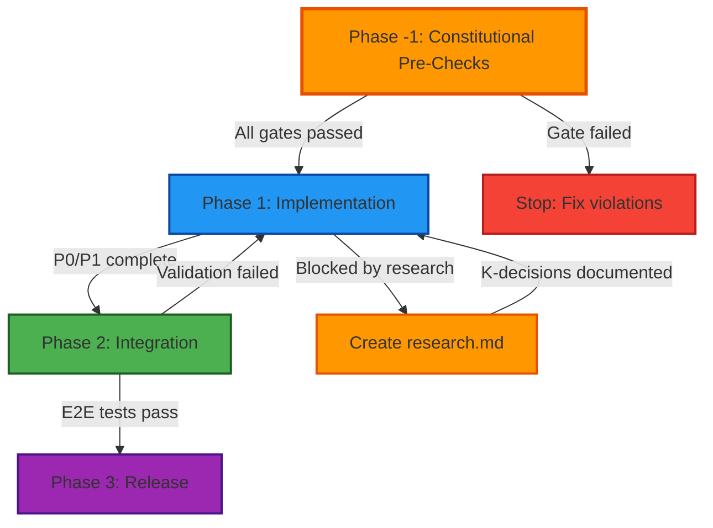

# 30-Minute SDD Presentation: Slide-by-Slide Breakdown

**Use with**: Google Slides + SLIDES_PROMPT.md style guide

---

## Design Constraints (From SLIDES_PROMPT.md)

### Text Limitations

- **Max 5 bullet points per content slide**
- **Max 15 words per bullet point**
- Avoid long paragraphs
- Use short, sharp phrases

### Layout Rules

- Embrace significant white/negative space
- Limit information blocks to 3-4 per slide
- Clear font hierarchy (titles, main content, supporting text)
- Professional graphics in dedicated spaces

### Visual Guidelines

- Use relevant graphics, charts, or icons
- Visuals support message (not decorative)
- Occupy dedicated space (16:9 or 1:1 placeholders)
- High contrast for readability

---

## Slide-by-Slide Creation Guide

### Section 1: The Problem & The Solution (Slides 1-6)

#### Slide 1: Title Slide

**Layout**: Title + Subtitle + Presenter Info + Date

**Text**:
- Title: "Spec-Driven Development with GitHub Spec-Kit"
- Subtitle: "From Idea to Production with AI-Assisted Workflows"
- [Your Name], [Your Title]
- [Date]

**Visual**: Split image showing:
- Left: Chaotic chat history (long conversation, confusion)
- Right: Clean spec.md document (organized structure)

**Design Notes**:
- Dark background (#1a1a1a) with light text (#f5f5f5)
- Center-aligned
- Logo/branding top-right corner
- Use arrow or transition graphic between chaos/order images

---

#### Slide 2: The Problem (Current State)

**Layout**: Title + Content Description + Key Problems

**Text**:
- Title: "The AI Agent Problem"

**Content**: Conversation Timeline showing context degradation
- Messages 1-10: Clear decisions ("Let's use PostgreSQL with JWT auth")
- Messages 20-30: Agent asks "What database should we use?" (already decided)
- Messages 40-50: Agent suggests incompatible approach, contradicts earlier decisions

**Key Problems to Highlight**:
1. **Context Loss**: Agent forgets decisions made 20 messages ago
2. **Redundant Questions**: Agent re-asks about testing strategy, database choice, API structure
3. **Implementation Drift**: Final code doesn't match original requirements
4. **No Shared Memory**: New session = start from zero
5. **Expensive Rework**: 10+ hours wasted on misaligned implementation

**Real-World Example** (anonymized):
```
Message 15: "Let's use REST API with pagination"
Message 48: Agent suggests GraphQL implementation
Developer: "Wait, didn't we decide on REST?"
Agent: "I don't have record of that decision"
```

**Implementation Options**:
- Diagram showing conversation flow with annotations
- Timeline visualization with fade effect for context loss
- Table format showing message progression
- Text-based description with numbered list

---

#### Slide 3: Traditional Approaches Fall Short

**Layout**: Title + Comparison Table + Icons

**Text**:
- Title: "Why Traditional Methods Don't Work"
- Table (2 columns, 3 rows):

| Approach | Problem |
|----------|---------|
| Pure chat | Context loss, no memory |
| Waterfall docs | Too rigid, disconnected |
| Agile stories | Too granular, missing arch |

**Visual**: Three icons with X marks
- Icons: 💬 (chat), 📄 (docs), 📋 (stories)
- Red X overlay on each icon
- Placement: Above each table row

**Design Notes**:
- Table: 60% of slide width, centered
- Icons: 80px each, left-aligned with table rows
- Use red (#f44336) for X marks

---

#### Slide 4: Introducing Spec-Driven Development

**Layout**: Title + Definition Box + 3 Principles (with icons)

**Text**:
- Title: "Spec-Driven Development (SDD)"
- Definition: "AI agents and humans collaborate through **structured artifacts** capturing WHAT, WHY, and HOW." (14 words)
- Principle 1: 📋 **Specs before code** (WHAT & WHY)
- Principle 2: 🏗️ **Plans before implementation** (HOW)
- Principle 3: ✅ **Tasks with acceptance criteria** (steps)

**Visual**: Definition box with highlighted keywords
- Box: Light background (#2a2a2a), bordered
- Keywords: Bold "structured artifacts", "WHAT", "WHY", "HOW"

**Design Notes**:
- Definition box: Top 30% of slide
- Principles: 3 columns below, equal width
- Icons: 60px, above principle text
- Font: 22pt for principles

---

#### Slide 5: Enter GitHub Spec-Kit

**Layout**: Title + Subtitle + Content Sections

**Text**:
- Title: "GitHub Spec-Kit: SDD Made Real"
- Subtitle: "Open-source framework from GitHub (2024)"

**What is Spec-Kit**:
- Open-source framework operationalizing Spec-Driven Development methodology
- Provides CLI + slash commands for AI coding assistants
- Used in production: JetBrains IdeaVim, Skyscanner Backpack, internal CLI tools

**System Requirements**:
- Python 3.11+ (required for CLI)
- Git (for branch management)
- AI coding assistant: GitHub Copilot, Claude, or Cursor
- Optional: `uv` tool installer (recommended) or `pip`

**Installation Command**:
```bash
# Option 1: Using uv (recommended)
uv tool install specify-cli --from git+https://github.com/github/spec-kit.git

# Option 2: Using pip
pip install git+https://github.com/github/spec-kit.git

# Verify installation
specify --version
```

**Initial Setup**:
```bash
# Initialize in existing project
cd your-project/
specify init --here --ai claude

# Or create new project
mkdir new-project && cd new-project
specify init --ai copilot
```

**What Gets Created**:
- `.specify/` directory (artifact storage)
- `.specify/templates/` (spec, plan, task templates)
- Configuration file: `.specify/config.yaml`

**Quick Start**:
```bash
# Create first specification
specify create spec "Add user authentication"

# Or use slash command in AI chat
/speckit.specify Add user authentication with JWT tokens
```

**Implementation Notes**:
- Use code blocks with syntax highlighting for commands
- Organize in clear sections: What, Requirements, Installation, Setup, Quick Start
- Consider tabbed or collapsible sections for different installation methods

---

#### Slide 6: The Spec-Kit Workflow (Visual)

**Layout**: Title + Flowchart (horizontal)

**Text**:
- Title: "The 7-Step Spec-Kit Workflow"
- Flowchart boxes (7 items):
  1. 🟢 `/speckit.constitution` → constitution.md
  2. 🔵 `/speckit.specify` → spec.md
  3. 🔷 `/speckit.clarify` → research.md (optional)
  4. 🟠 `/speckit.plan` → plan.md
  5. 🟣 `/speckit.tasks` → tasks.md
  6. 🟡 `/speckit.analyze` → validation (optional)
  7. 🔴 `/speckit.implement` → executes tasks

**Visual**: Flowchart with arrows and color coding
- Layout: Horizontal flow, left to right
- Arrows: Bold, connecting boxes
- Colors:
  - Green (#4caf50): Setup (constitution)
  - Blue (#2196f3): Specification (specify)
  - Light Blue (#03a9f4): Specification - optional (clarify)
  - Orange (#ff9800): Planning (plan)
  - Purple (#9c27b0): Execution (tasks)
  - Yellow (#ffc107): Quality - optional (analyze)
  - Red (#f44336): Execution (implement)

**Design Notes**:
- Boxes: 150px wide, 80px tall
- Font: 18pt for commands, 14pt for artifacts
- Use rounded corners on boxes
- Arrow width: 4px
- Optional steps (clarify, analyze): Use dashed border (2px) and 80% opacity
- Optional label: Display "(optional)" in 12pt italic below command name

---

### Section 2: The Core Artifacts (Slides 7-16)

#### Slide 7: Section Title

**Layout**: Large Title + Subtitle + Visual

**Text**:
- Title: "The Four Artifacts" (large, 48pt)
- Subtitle: "Real examples from production projects"

**Visual**: 4 document icons in row
- Icons: 📜 (constitution), 📋 (spec), 📐 (plan), ✅ (tasks)
- Size: 100px each
- Placement: Bottom 40% of slide, evenly spaced

**Design Notes**:
- Minimal text, maximum impact
- White space: 50% of slide
- Icons: Subtle animation (fade in) if presenting digitally

---

#### Slide 8: Artifact #1 – constitution.md

**Layout**: Title + Content Sections (No Visual)

**Text**:
- Title: "constitution.md: Your Project's Immutable Laws"

**What IS a Constitution** (Brief overview):
- Project's foundational rules governing ALL development work
- Created once, then versioned (semver: 1.0.0 → 1.0.1 → 2.0.0)
- Referenced by all artifacts via `sync_impact` field
- Enforced through templates, Phase -1 gates, and CI/CD checks

**What to Include - Core Articles** (Article I-V):

Present in structured format:

**Article I: Non-Negotiable Rules**
- Legal requirements (licenses, copyright headers)
- Security mandates (dependency scanning, credential handling)
- Tooling constraints (specific CI/CD, required linters)
- Example: "Apache 2.0 license headers REQUIRED in all source files"

**Article II: Testing Standards**
- Unit test coverage thresholds (e.g., "80% minimum")
- Integration test requirements
- Test-first vs test-after policies
- Example: "P1 features MUST have unit tests before PR approval"

**Article III: Code Organization**
- Directory structure conventions
- Module/package naming patterns
- Architectural boundaries
- Example: "All public APIs in `src/api/`, internals in `src/internal/`"

**Article IV: Documentation Standards**
- README requirements (badges, setup instructions)
- API documentation format (JSDoc, docstrings)
- Changelog maintenance
- Example: "All public functions MUST have docstrings with param types"

**Article V: Dependency Management**
- Approved dependency sources
- Version pinning policies
- Security update cadence
- Example: "Lock files MUST be committed; no floating versions in production"

**What NOT to Include** (Clear boundaries):
- ❌ Implementation details: "Use React hooks" (belongs in plan.md)
- ❌ Feature-specific requirements: "Login page must have email field" (belongs in spec.md)
- ❌ Temporary decisions: "Use mock API for now" (belongs in research.md)
- ❌ Personal preferences: "I prefer tabs over spaces" (team discussion, not constitution)

**Additional Articles (Article X+)** - When to Add:

Explain when projects need additional articles:
- Project grows from POC → MVP → Production
- New compliance requirements emerge (SOC2, HIPAA)
- Team expands and needs process clarity

**Common Additional Articles**:

**Article VI: Security Standards**
- Secrets MUST NOT be committed
- All API endpoints MUST validate input
- Authentication required for non-public routes
- Regular dependency audits (monthly)

**Article VII: Performance Requirements**
- Page load time < 3 seconds (desktop)
- API response time < 200ms (95th percentile)
- Bundle size < 500KB (initial load)
- Core Web Vitals: LCP < 2.5s, FID < 100ms, CLS < 0.1

**Article VIII: Accessibility Standards**
- WCAG 2.1 AA compliance REQUIRED
- All interactive elements keyboard navigable
- Color contrast ratio ≥ 4.5:1 for text
- Screen reader tested before production

**Article IX: Deployment & Release**
- Main branch ALWAYS deployable
- Feature flags for incomplete features
- Rollback plan documented for all releases
- Blue-green deployment for production

**Article X: Monitoring & Observability**
- Error tracking configured
- Logging standards (structured JSON logs)
- Metrics dashboards for critical paths
- On-call runbooks for each service

**Version Semantics**:

**PATCH** (1.0.0 → 1.0.1): Typo fixes, clarifications, no rule changes → Optional regeneration
**MINOR** (1.0.x → 1.1.0): New articles added, stricter enforcement → Review in-flight work
**MAJOR** (1.x.x → 2.0.0): Rules removed/changed, POC→Production → MUST regenerate all artifacts

**Examples**:

**Backpack Constitution**:
```yaml
version: 1.0.2
# Article I: NON-NEGOTIABLE - Apache 2.0 License
# Article II: NON-NEGOTIABLE - Nx Workspace Structure  
# Article III: Component Testing (Jest, Chromatic, axe-core)
```

**Manifest Constitution Evolution**:
```yaml
# v1.1.0 (POC): [DEFERRED FOR POC] Testing, Performance
# v2.0.0 (MVP): ✅ Testing REQUIRED, Performance enforced, Security added
```

**Implementation Notes**:
- Focus on WHAT to include in each article type
- Emphasize Article X+ as growth path
- Use collapsible sections for detailed article descriptions
- Highlight version semantic implications clearly
- No visual needed - content is self-explanatory

---

#### Slide 9: Constitution Evolution (Real Example)

**Layout**: Title + Side-by-Side Comparison + Arrow

**Text**:
- Title: "Constitution Evolution: POC → Production"
- Table (2 columns):

| Manifest v1.1.0 (POC) | Manifest v2.0.0 (MVP) |
|-----------------------|-----------------------|
| [DEFERRED] Testing | ✅ Tests REQUIRED |
| [DEFERRED] Performance | ✅ Perf metrics enforced |
| Security: Not mentioned | ✅ Article VI: Security |

**Visual**: Large arrow showing version jump
- Arrow: Center of slide, pointing right
- Text on arrow: "MAJOR BUMP"
- Color: Orange (#ff9800) for warning

**Design Notes**:
- Left column: Faded/gray text for "DEFERRED"
- Right column: Green checkmarks, bold text
- Table: 80% of slide width
- Font: 20pt for table text

---

#### Slide 10: Artifact #2 – spec.md

**Layout**: Title + Content Sections (No Visual - No Comparison)

**Text**:
- Title: "spec.md: The WHAT and WHY"

**Purpose of spec.md**:
- Captures **WHAT** needs to be built and **WHY** it matters
- Does **NOT** prescribe **HOW** to implement (that's plan.md's job)
- Single source of truth for requirements
- Readable by both humans and AI agents

**Required Elements for Complete Spec** (Detailed requirements for each section):

**1. Frontmatter (Metadata)**
Present required fields and their purposes:
```yaml
feature_name: "User Authentication System"  # Clear, concise (≤60 chars)
branch_id: "branch-042-auth"               # Branch identifier
complexity: High                            # Low/Medium/High
effort: Large (2-3 weeks)                   # Small/Medium/Large + time
status: approved                            # draft/needs_clarification/approved
sync_impact: 1.2.2                         # Constitution version alignment
companion_research: research-042-auth.md    # If complex (optional)
```

**2. Context & Motivation** (The WHY)
Must answer:
- Business problem: What pain point are we solving?
- User impact: Who benefits and how?
- Strategic alignment: How does this fit roadmap/goals?
- Success criteria: What does "done" look like?

Example structure to include:
```
## Context
[Describe current situation and pain points]

## Motivation  
[Explain why this matters and expected benefits]
```

**3. User Stories with Acceptance Criteria**
Requirements:
- Minimum 3 user stories (unless trivial feature)
- Prioritize: P0 (critical), P1 (high), P2 (nice-to-have)
- Acceptance criteria MUST be testable/verifiable
- Define "out of scope" explicitly (prevents scope creep)

Format:
```
### User Story 1 [Priority: P1]
**As a** [persona]
**I want** [capability]
**So that** [business value]

**Acceptance Criteria**:
- [ ] Given [context], when [action], then [outcome]
- [ ] Given [context], when [action], then [outcome]

**Out of Scope**:
- [Explicitly list what's NOT included]
```

**4. Functional Requirements**
Structure each requirement with:
- **Description**: Clear statement of what system must do
- **Rationale**: Why this is necessary
- **Dependencies**: Other FRs, K-decisions, or external factors

**5. Non-Functional Requirements (NFRs)**
Categories to cover:
- Performance: Response time, throughput, resource usage
- Scalability: User load, data volume limits
- Security: Auth, encryption, input validation
- Reliability: Uptime, error rates, recovery
- Maintainability: Code quality, documentation
- Usability: Accessibility, error messages, learnability

**6. Constraints**
Must define:
- **In Scope**: What is included
- **Out of Scope**: What is explicitly NOT included (critical for preventing scope creep)
- **Technical Constraints**: Platform limitations, compatibility requirements

**7. Success Metrics**
Requirements:
- Must be quantifiable (not vague like "improve stability")
- Include measurement criteria
- Define timeline for measurement

Example:
```
- 10+ plugins migrated to new API within 3 months
- Zero internal refactoring blocked by external deps
- API stability: no breaking changes for 6+ months
- Plugin developer satisfaction: ≥4/5 in survey
```

**8. Open Questions / Needs Clarification**
Use [NEEDS CLARIFICATION] markers
Track dated Q&A sessions with decisions

**Spec Quality Checklist**:

MUST have:
- ✅ Clear problem statement (WHY)
- ✅ 3+ prioritized user stories with testable acceptance criteria
- ✅ Explicit out-of-scope items
- ✅ Functional requirements with dependencies
- ✅ Non-functional requirements (performance, security, etc.)
- ✅ Success metrics (quantifiable)
- ✅ Constitutional alignment (sync_impact field)

MUST NOT have:
- ❌ Implementation details ("use React hooks")
- ❌ Technology choices ("PostgreSQL database")
- ❌ File structure ("create src/api/auth.ts")
- ❌ Task breakdowns ("Step 1: Create schema")

**When to Create Companion research.md**:
- Multiple architectural approaches exist
- Complex trade-offs need documentation
- Platform constraints require investigation
- Decision rationale needs preservation

**Spec Complexity Scale**:

| Aspect | Simple (Taskify) | Complex (IdeaVim API) |
|--------|------------------|----------------------|
| Lines | 158 | 249 |
| User Stories | 5 (straightforward) | 10 (prioritized P0/P1/P2) |
| Personas | 1 (developer) | 3 (core dev, plugin dev, user) |
| Acceptance | Simple checklists | Given/When/Then scenarios |
| NFRs | Minimal (basic perf) | Extensive (compat, docs, perf) |
| Research | None needed | 418 lines (K1-K6 decisions) |
| Effort | Small (2-3 days) | Large (4-6 weeks) |

**Implementation Notes**:
- Present as comprehensive checklist/requirements guide
- Use expandable sections for detailed requirements
- Emphasize that structure is consistent but content depth scales
- No screenshots needed - focus on requirements clarity

---

#### Slide 11: spec.md in Action (Real Example)

**Layout**: Title + Unique Features Analysis (No Visual)

**Text**:
- Title: "Real Spec: IdeaVim API Layer - Unique Features"

**Project Context**:
- Project: JetBrains IdeaVim (10,000+ GitHub stars)
- Context: Refactoring plugin API to separate internal/external boundaries
- Spec: `artifacts/spec-example-ideavim-api.md` (249 lines)

**Unique Feature #1: Multi-Stakeholder Personas**

Most specs have 1-2 personas. IdeaVim has **3 distinct personas**:
- **Persona 1: IdeaVim Core Developer** - Needs freedom to refactor internals
- **Persona 2: External Plugin Developer** - Needs stable API contract
- **Persona 3: IdeaVim End User** - Needs working plugin ecosystem

**Lesson**: Complex features often impact multiple stakeholder groups. Spec must acknowledge all perspectives.

**Unique Feature #2: Priority-Driven User Stories**

Stories triaged by impact:
- **P0 (Critical)**: Core API surface definition - MUST complete first
- **P1 (High)**: Editor state queries - Dependencies on P0
- **P2 (Nice-to-have)**: Advanced mode transitions - Can defer to v1.1

**Lesson**: For large features, prioritization prevents scope creep and enables phased delivery.

**Unique Feature #3: Given/When/Then Acceptance Criteria**

Simple specs use checklists. IdeaVim uses **BDD-style scenarios**:
```
- [ ] Given editor in NORMAL mode, 
      when extension calls editorOrNull(), 
      then returns Editor instance
      
- [ ] Given no active editor, 
      when extension calls editorOrNull(), 
      then returns null (no exception)
```

**Lesson**: Given/When/Then forces clarity on edge cases and error handling.

**Unique Feature #4: Companion Research Artifact Reference**

Spec includes: `companion_research: research-example-ideavim-api.md` (418 lines)

Research.md contains 6 K-numbered decisions:
- K1: State Update Safety (prevents editor corruption)
- K2: Functional vs Builder Patterns (API design choice)
- K3: API Surface Scope (what to expose vs hide)
- K4: Error Handling Strategy
- K5: Thread Safety Guarantees
- K6: Versioning Strategy

**Lesson**: Don't bloat spec with design debates. Extract to research.md, reference by K-number.

**Unique Feature #5: Explicit Backward-Compatibility Stance**

Most specs avoid mentioning breaking changes. IdeaVim is **explicit**:
```
Breaking Change Accepted: This API refactoring WILL break 
existing plugins that directly import internal classes.

Mitigation:
- Migration guide provided
- 3-month deprecation period
- Clear error messages pointing to new API
```

**Lesson**: If breaking changes are necessary, document rationale and mitigation upfront.

**Unique Feature #6: Quantified Success Metrics**

```
- ≥10 plugins migrated within 3 months
- Zero internal refactoring blocked by API surface (6 months post-launch)
- API stability: no breaking changes for ≥6 months
- Plugin dev satisfaction: ≥4/5 in survey
```

**Lesson**: Vague goals ("improve stability") vs measurable outcomes ("≥10 plugins migrated").

**Patterns from Skyscanner Backpack Example**:

**Infrastructure-Focused Spec** (not user-facing):
- effort: Large (2 weeks, 95+ packages to move)
- complexity: Small (file moves, config updates - tedious but not risky)

**Lesson**: Large effort ≠ high complexity
- Large effort + small complexity = parallelizable, low risk
- Small effort + high complexity = needs research.md, careful design

**Validation-Centric Acceptance Criteria** for infrastructure:
- All 95+ packages moved to libs/ structure
- CI pipeline passes (green builds)
- No import path breakage (consumers unaffected)
- Documentation updated
- Chromatic visual regression tests pass (no UI changes)

**Lesson**: For infrastructure work, validation IS the primary deliverable.

**Common Patterns Across Production Specs**:
1. Dated clarification sessions preserved in spec (transparency)
2. Constitutional references (sync_impact, NON-NEGOTIABLE compliance)
3. Out-of-scope is explicit (prevents scope creep)
4. Success metrics are quantified (not "improve", but "≥10 plugins")
5. Dependencies tracked (K-decisions, other features, external factors)

**Scaling Patterns**:
- Simple feature (158 lines): 1 persona, 5 stories, basic acceptance
- Complex feature (249 lines): 3 personas, 10 prioritized stories, Given/When/Then, companion research.md

**Key Takeaway**: Spec.md structure is consistent (frontmatter, context, stories, requirements, constraints), but **content depth scales** with feature complexity.

**Implementation Notes**:
- Present as detailed feature analysis
- Use examples from real files: `artifacts/spec-example-ideavim-api.md`, `artifacts/spec-example-backpack-nx.md`
- No screenshots needed - content explains unique patterns
- Focus on lessons learned from production examples

---

#### Slide 12: Artifact #2.5 – research.md (Optional)

**Layout**: Title + Purpose + "When to create" list + K-example + Visual

**Text**:
- Title: "research.md: The Secret Weapon (20% of features)"
- Purpose: "Technical investigations & decision logs" (5 words)
- When to create:
  - "Multiple architectural approaches exist" (4 words)
  - "Platform constraints need documentation" (4 words)
  - "Trade-offs require explicit rationale" (4 words)
- K-numbered format:
  - K1: State Update Safety
  - K2: Functional vs Builder Patterns
  - K3: API Surface Scope

**Visual**: Screenshot of research.md K1 structure
- Source: `research-example-ideavim-api.md` (lines 53-80)
- Dimensions: 600x400px
- Placement: Right 40% of slide
- Annotations: Highlight "K1:", "Problem", "Decision", "Rationale" sections
- File: `media/presentation-screenshots/06-research-k-decision.png`

**Design Notes**:
- K-numbers: Monospace font, bold
- Use lightning bolt icon (⚡) near title for "Secret Weapon"

---

#### Slide 13: Artifact #3 – plan.md

**Layout**: Title + Phase Description + Mermaid Diagram

**Text**:
- Title: "plan.md: The HOW"
- Purpose: "Implementation approach WITHOUT micro-tasks"

**Phase Structure Description** (Textual explanation):

**Phase -1: Constitutional Pre-Checks** (ALWAYS FIRST)
- **Purpose**: Verify all NON-NEGOTIABLE requirements met BEFORE implementation
- **Gates**: License headers, CI checks configured, documentation templates, security scan baseline
- **Output**: Go/No-Go decision to proceed
- **Rationale**: Catches constitutional violations early (before code written)
- **Failure Mode**: If ANY item fails, STOP. Fix before Phase 1.

Example checklist:
```
- [ ] Apache 2.0 headers in all .ts/.tsx files
- [ ] Unit test structure exists (test/ directory)
- [ ] ESLint config includes required rules
- [ ] README template populated
- [ ] CODEOWNERS file updated for new module
```

**Phase 1: Implementation Core**
- **Purpose**: Build primary functionality
- **Activities**: Implement core features (P0/P1 user stories), write unit tests, create API contracts
- **Dependencies**: K-decisions from research.md (e.g., "Phase 1 implements K1, K2")
- **Gates**: All P0 acceptance criteria met, unit test coverage ≥80%, no critical security issues

Example:
```
## Phase 1: API Finalization
Goal: Implement `ideavim-api` module with core editor operations
Tasks: Implement editorOrNull() (K2 pattern), mode query methods (K1 safety)
Success: All P0 stories implemented, 95%+ test coverage, KDoc on all APIs
```

**Phase 2: Integration & Validation**
- **Purpose**: Connect pieces, test end-to-end
- **Activities**: Integration tests, performance validation, migration guide creation, documentation finalization
- **Gates**: E2E tests pass, performance NFRs met, documentation reviewed
- **Failure Mode**: If validation fails, return to Phase 1 for fixes

**Phase 3: Release & Monitoring** (Optional)
- **Purpose**: Deploy, monitor, iterate
- **Activities**: Production deployment, monitoring setup, feedback collection
- **Gates**: Deployment successful, no critical bugs in first week, success metrics trending positive

**Phase Flow Diagram** (Mermaid + Textual Explanation):

**Diagram**:


**Diagram Explanation** (describe what colors/shapes mean):
- **Orange boxes** (Phase -1, research.md creation): Quality gates / checkpoints - must resolve before continuing
- **Blue box** (Phase 1): Primary development work - implementation of core functionality
- **Green box** (Phase 2): Validation / integration - testing and documentation
- **Purple box** (Phase 3): Deployment / release - production rollout
- **Red box** (Stop): Failure path - constitutional violations must be fixed immediately
- **Solid arrows**: Normal process flow - expected path through phases
- **Dashed arrows** (if using): Exception paths - research needed or validation failures requiring backtrack

**Flow Explanation**:
1. Start with Phase -1 (constitutional checks)
2. If gates fail → Stop and fix violations (red path)
3. If gates pass → Proceed to Phase 1 (implementation)
4. If research needed during Phase 1 → Create research.md with K-decisions, then resume
5. Phase 1 complete → Move to Phase 2 (integration)
6. If validation fails in Phase 2 → Return to Phase 1 for fixes
7. If validation passes → Proceed to Phase 3 (release)

**Standard Plan Structure** (what every plan.md should contain):
- Technology stack + rationale (React + PostgreSQL because...)
- System architecture (diagrams, data models, API contracts)
- Phases with gates (Phase -1: constitutional checks)
- Risk & complexity tracking (K-decision references)

**Implementation Notes**:
- Mermaid diagram can be rendered in most documentation systems
- Provide both diagram AND textual description (accessibility + clarity)
- Emphasize Phase -1 as critical safety mechanism
- Show how research.md integrates into flow (not separate, but part of process)
- Highlight failure paths and recovery (not just happy path)

---

#### Slide 14: plan.md Example (Infrastructure)

**Layout**: Title + Context + Pull Quote + 3 Bullets + Visual

**Text**:
- Title: "Real Plan: Backpack Nx Migration"
- Context: "Skyscanner Backpack design system (95+ packages)" (7 words)
- Pull Quote:
  > "Reorganize project structure from flat packages/ to domain-grouped structure under libs/"
- Bullet 1: "Type: Infrastructure (not user-facing)" (5 words)
- Bullet 2: "Effort: Large (2 weeks), Complexity: Small" (7 words)
- Bullet 3: "Phases: Preparation → Migration → Validation" (5 words)

**Visual**: Phase breakdown diagram
- Show 3 boxes: Preparation | Migration | Validation
- Arrows connecting boxes
- Brief description under each
- Dimensions: 900x250px
- Placement: Bottom 35% of slide

**Design Notes**:
- Pull quote: Monospace font for paths
- Phase boxes: Same style as Slide 6 flowchart

---

#### Slide 15: Artifact #4 – tasks.md

**Layout**: Title + Purpose + 4 Bullets + Visual (right)

**Text**:
- Title: "tasks.md: The Executable Breakdown"
- Purpose: "Actionable tasks with dependencies & acceptance" (6 words)
- Bullet 1: "Grouped by plan phases" (4 words)
- Bullet 2: "Dependencies (K-decisions, other tasks)" (5 words)
- Bullet 3: "Effort estimates (S/M/L)" (4 words)
- Bullet 4: "Acceptance criteria (testable)" (3 words)

**Visual**: Screenshot of Task 1.1
- Source: `tasks-example-ideavim-api.md` (find Task 1.1)
- Dimensions: 700x500px
- Placement: Right 45% of slide
- Annotations: Highlight "Dependencies:", "Acceptance Criteria:"
- File: `media/presentation-screenshots/08-task-example.png`

**Design Notes**:
- Use checkbox icon (✅) near title
- Highlight S/M/L with color coding (Green/Orange/Red)

---

#### Slide 16: The Artifact Relationship (Visual Summary)

**Layout**: Title + Flowchart + 3 Traceability Examples

**Text**:
- Title: "How Artifacts Connect"
- Flowchart (vertical):
  ```
  constitution.md (v1.2.2)
       ↓
  spec.md (sync_impact: 1.2.2)
       ↓ (if complex)
  research.md (K1, K2, K3)
       ↓
  plan.md (references K1, K2)
       ↓
  tasks.md (dependencies: K1, K2)
  ```
- Traceability examples:
  - "Plan references spec: `companion_spec`" (4 words)
  - "Tasks cite K-decisions: 'Dependencies: K2'" (5 words)
  - "Spec tracks constitution: `sync_impact: 1.2.2`" (5 words)

**Visual**: Create flowchart diagram
- Boxes: 250px wide, 60px tall
- Arrows: Labeled with relationship type
- Color code boxes by artifact type
- Optional annotations on arrows

**Design Notes**:
- Center flowchart, left 50% of slide
- Traceability examples: Right 45%, bulleted
- Use link icon (🔗) for connections

---

### Section 3: Practical Application (Slides 17-21)

#### Slide 17: Section Title

**Layout**: Large Title + Subtitle + Visual

**Text**:
- Title: "Putting It Into Practice" (48pt)
- Subtitle: "DOs, DON'Ts, and Tricks from Production"

**Visual**: Large checklist icon (✅)
- Size: 150px
- Placement: Center of slide, below subtitle
- Optional: Green/red split background (subtle)

**Design Notes**:
- Minimal text, breather slide
- White space: 60% of slide

---

#### Slide 18: DOs and DON'Ts (Part 1: Specs)

**Layout**: Title + Two-Column Table

**Text**:
- Title: "Spec Best Practices"
- Table:

| ✅ DO | ❌ DON'T |
|-------|----------|
| Use [NEEDS CLARIFICATION] markers | Guess missing requirements |
| Track dated Q&A sessions | Bury decisions in chat |
| Define out-of-scope explicitly | Assume "obvious" scope |

**Visual**: Green checkmarks (✅) and red X marks (❌)
- Size: 40px
- Placement: In table cells, before text

**Design Notes**:
- Table: 90% of slide width, centered
- Left column: Light green background (#e8f5e9)
- Right column: Light red background (#ffebee)
- Font: 22pt for table text
- Cell padding: Generous (20px)

---

#### Slide 19: DOs and DON'Ts (Part 2: Plans & Tasks)

**Layout**: Title + Two-Column Table

**Text**:
- Title: "Planning Best Practices"
- Table:

| ✅ DO | ❌ DON'T |
|-------|----------|
| Use Phase -1 gates | Skip pre-checks until PR |
| Reference K-decisions by number | Copy/paste rationale |
| Update sync_impact when regen | Ignore version bumps |

**Visual**: Same style as Slide 18

**Design Notes**:
- Same layout as Slide 18 for consistency
- Use code formatting for `Phase -1`, `sync_impact`, `K-decisions`

---

#### Slide 20: Common Pitfalls

**Layout**: Title + 3 Numbered Items (with sub-bullets)

**Text**:
- Title: "3 Common Mistakes (and How to Avoid Them)"
- Items:
  1. **Over-specifying in spec.md**
     - Symptom: Spec includes implementation details
     - Fix: Move "how" to plan.md
  2. **Under-using research.md**
     - Symptom: Plan has 5 pages of justification
     - Fix: Extract to research.md with K-numbers
  3. **Ignoring constitution evolution**
     - Symptom: Old branches fail CI after bump
     - Fix: Use SYNC IMPACT reports

**Visual**: Warning icon (⚠️) near title
- Size: 60px
- Color: Orange (#ff9800)

**Design Notes**:
- Numbers: Large, bold (36pt), colored
- Symptoms: Italic, gray text
- Fixes: Bold, green text
- Spacing: Generous between items

---

#### Slide 21: Pro Tips & Tricks

**Layout**: Title + 5 Numbered Tips (with lightning bolt icons)

**Text**:
- Title: "5 Pro Tips from Production"
- Tips:
  1. ⚡ Start with lightweight constitution (add later)
  2. ⚡ Use `effort: S/M/L` + `complexity` separately
  3. ⚡ Mark NON-NEGOTIABLE sparingly (critical only)
  4. ⚡ Create research.md when re-arguing decisions
  5. ⚡ Version bump conservatively (unsure = higher)

**Visual**: Lightning bolt icons (⚡)
- Size: 40px
- Placement: Before each tip number

**Design Notes**:
- Tips: Numbered 01-05 (two digits, bold)
- Font: 22pt for tips
- Background: Subtle gradient (dark to darker)
- Code terms: Monospace (`effort:`, `complexity`)

---

### Section 3.5: Advanced Topics (Slides 21A-21E)

#### Slide 21A: Section Title

**Layout**: Large Title + Subtitle + 4 Icons + Visual

**Text**:
- Title: "Advanced Topics" (48pt)
- Subtitle: "Fixing, refining, integrating, and optimizing"

**Visual**: 4 icons in row
- Icons: 🔧 (fixing), 📅 (workflow), 🔄 (integration), ⚡ (optimization)
- Size: 100px each
- Placement: Bottom 40% of slide, evenly spaced

**Design Notes**:
- Minimal text, breather slide
- White space: 50% of slide
- Subtle animation on icons if digital presentation
- Dark background consistent with overall theme

---

#### Slide 21B: Fixing Specs Mid-Development

**Layout**: Title + Q&A Format + 5 Bullets

**Text**:
- Title: "Q: How to Fix Bugs in Spec/Plan After Tasks Started?"

**Answer** (5 concise bullets):
1. **Stop & Assess**: Pause work, determine scope of impact
2. **Version the Spec**: Update `sync_impact` field in frontmatter
3. **Regenerate Selectively**: Use `/speckit.tasks --regenerate` for affected tasks only
4. **Mark Changes**: Add [AMENDED] markers to show what changed
5. **Update Companions**: Sync plan.md and research.md if decisions changed

**Visual**: Warning icon (⚠️) near title
- Size: 60px
- Color: Orange (#ff9800)
- Placement: Top-right corner

**Design Notes**:
- Use numbered list (01-05 style) for clarity
- Highlight `/speckit.tasks --regenerate` in monospace font
- Code terms: Monospace (`sync_impact`, `[AMENDED]`)
- Keep bullets under 15 words each

---

#### Slide 21C: Daily Workflow & Refinements

**Layout**: Title + Q&A Format + Two Columns

**Text**:
- Title: "Q: How to Organize Daily Work? Need for Refinements?"

**Answer - Left Column: Daily Cadence**
1. **Morning**: Review spec.md before coding
2. **During Work**: Use [NEEDS CLARIFICATION] for questions
3. **End of Day**: Update task status in tasks.md

**Answer - Right Column: Refinement Sessions**
1. **Weekly**: Hold 30-min refinement for open questions
2. **Monthly**: Review constitution.md for updates
3. **Between Features**: Capture lessons learned

**Visual**: Calendar icon (📅) and checklist icon (✅)
- Size: 50px each
- Placement: Above each column
- Colors: Blue (#2196f3) for calendar, Green (#4caf50) for checklist

**Design Notes**:
- Two equal columns (50/50 split)
- Clear visual separation between daily and weekly cadence
- Use time indicators: "30-min", "Morning", "Weekly"
- Keep practical and actionable

---

#### Slide 21D: Jira Export Best Practices

**Layout**: Title + Q&A Format + 3 Approaches + Mapping Table

**Text**:
- Title: "Q: How to Export Spec-Kit Tasks to Jira?"

**Answer: Three Approaches**
1. **Manual**: Copy tasks → Jira descriptions with acceptance criteria
2. **CLI**: Use Jira CLI + task IDs as external links
3. **API**: Script to sync tasks.md → Jira (for large teams)

**Mapping Table** (2 columns, 4 rows):

| Spec-Kit Artifact | Jira Field |
|-------------------|------------|
| Phase | Epic |
| Task | Story |
| Acceptance Criteria | Sub-tasks or Checklist |
| Dependencies (K-refs) | Linked Issues |

**Visual**: Integration icon (🔄)
- Size: 60px
- Placement: Top-right corner
- Color: Purple (#9c27b0)

**Design Notes**:
- Table: 60% of slide width, centered below approaches
- Monospace font for artifact names
- Add note: "Link back: Add Jira URLs to tasks.md for traceability"
- Emphasize bi-directional sync for large teams

---

#### Slide 21E: Token Optimization Strategies

**Layout**: Title + Q&A Format + 5 Tips with Icons

**Text**:
- Title: "Q: How to Avoid Burning Tokens Quickly?"

**Answer: 5 Optimization Strategies**
1. ⚡ **Use K-References**: Link to decisions instead of repeating
2. 📝 **Keep Specs Concise**: Focus on WHAT/WHY, not HOW
3. 🔄 **Batch Operations**: Regenerate multiple artifacts together
4. 📋 **Reuse Templates**: Standardize patterns in constitution.md
5. 💾 **Cache with research.md**: Store complex context once

**Visual**: Lightning bolt icon (⚡) near title
- Size: 80px
- Placement: Top-right corner
- Color: Yellow (#ffc107)

**Cost Context Box** (bottom of slide):
- "Typical costs: Spec (500 tokens), Plan (800 tokens), Tasks (600 tokens)"
- "With optimization: 30-50% token reduction"

**Design Notes**:
- Icons: 40px before each tip
- Numbered 01-05 (bold, two digits)
- Highlight token counts in monospace
- Cost box: Light background (#2a2a2a), bordered
- Keep practical and quantifiable

---

### Section 4: Demo & Next Steps (Slides 22-24)

#### Slide 22: Quick Demo (Hybrid)

**Layout**: Title + Decorative Visual

**Text**:
- Title: "Demo"

**Visual**: Decorative graphic suggestions:
- Terminal window icon with command prompt aesthetic
- Workflow visualization (simple flowchart: idea → spec → plan → tasks)
- Command-line aesthetic with stylized `/speckit.specify` command
- Minimalist "live demo" indicator

**Content**: Minimal - let the demo speak

**Demo Flow** (for presenter, not on slide):
1. Show command: `/speckit.specify Build a simple Todo App`
2. Show generated spec.md excerpt (frontmatter + first user story)
3. Timing: 30-60 seconds maximum
4. Have backup: static example ready if live demo fails

**Implementation Notes**:
- Keep slide extremely minimal - just title and decorative element
- Decorative visual should be simple, not distracting
- Consider: Command prompt symbol, workflow arrows, or abstract geometric pattern
- No detailed content on slide - demo is the content
- Presenter should have backup plan if live demo fails

---

#### Slide 23: Getting Started

**Layout**: Title + 3-Step Checklist + Code Blocks

**Text**:
- Title: "Try It Monday Morning"
- Steps:
  1. 🛠️ **Install**
     ```bash
     uv tool install specify-cli --from git+https://github.com/github/spec-kit.git
     ```
  2. ⚙️ **Initialize**
     ```bash
     specify init --here --ai claude
     ```
  3. 🚀 **First feature**
     ```
     /speckit.specify <your simplest backlog item>
     ```

**Visual**: Icons (🛠️ ⚙️ 🚀)
- Size: 50px
- Placement: Before each step number

**Design Notes**:
- Code blocks: Dark background (#2a2a2a), syntax highlighted
- Font: Fira Code or Monaco (monospace), 18pt
- Blocks: 90% of slide width
- Generous padding in code blocks (15px)

---

#### Slide 24: Resources

**Layout**: Title + 3 Resource Categories + QR Code (optional)

**Text**:
- Title: "Learn More"
- Resources:
  - 📖 **Official repo**: `github.com/github/spec-kit`
  - 📂 **This guide**: [Your repository URL]
  - 💬 **Real examples**:
    - JetBrains IdeaVim: `artifacts/spec-example-ideavim-api.md`
    - Skyscanner Backpack: `artifacts/constitution-example-backpack.md`
    - Manifest CLI: `artifacts/constitution-example-manifest.md`

**Visual**: QR code (if in-person)
- Size: 200x200px
- Placement: Bottom right corner
- Links to: Your guide repository

**Design Notes**:
- Icons: 50px, before each category
- URLs: Monospace font, slightly smaller (18pt)
- Bullets: Indented under each category
- QR code: Optional, only if presenting in-person

---

### Section 5: Q&A (Slide 25)

#### Slide 25: Q&A

**Layout**: Title + Large Icon + Contact Info

**Text**:
- Title: "Questions?"
- Subtitle (optional): "Let's discuss how Spec-Kit can help your team"
- Contact info:
  - Email: [your.email@company.com]
  - Slack: #ai-research (or relevant channel)
  - Guide repo: [shortened URL]

**Visual**: Large Q&A icon or question mark
- Size: 200px
- Placement: Center of slide
- Color: Blue (#2196f3)

**Design Notes**:
- Minimal text, inviting
- White space: 60% of slide
- Font: Contact info 22pt, gray
- Optional call-to-action: "Join AI & RnD Community"

---

## Screenshot Specifications

### Screenshot 1: AI Conversation Chaos

**File**: `media/presentation-screenshots/01-ai-conversation-chaos.png`

**Source**: ChatGPT or Claude chat export

**Dimensions**: 800x600px

**Content**:
- Long conversation (20+ messages visible)
- Highlight a message showing confusion: "Wait, what did we decide about authentication?"
- Blur any sensitive/proprietary content

**Annotations**:
- Red highlight box around confusion message
- Optional: Add label "Context Lost"

---

### Screenshot 2: Spec-Kit CLI Help

**File**: `media/presentation-screenshots/02-speckit-cli-help.png`

**Source**: Terminal running `specify --help`

**Dimensions**: 1000x400px

**Content**:
- Full help output showing available commands
- Syntax-highlighted (use VS Code terminal or similar)

**Annotations**: None needed

---

### Screenshot 3: Constitution Frontmatter

**File**: `media/presentation-screenshots/03-constitution-frontmatter.png`

**Source**: `artifacts/constitution-example-backpack.md` (lines 1-10)

**Dimensions**: 600x400px

**Content**:
```yaml
---
version: 1.0.2
constitution_version: 1.0.2
previous_version: 1.0.1
---
```

**Annotations**:
- Green highlight box around `version: 1.0.2`
- Optional label: "Version Tracking"

---

### Screenshot 4: Spec Comparison

**File**: `media/presentation-screenshots/04-spec-comparison.png`

**Source**:
- Left: `artifacts/spec-example-taskify.md` (lines 20-50)
- Right: `artifacts/spec-example-ideavim-api.md` (lines 50-80)

**Dimensions**: Combined 1000x300px (500px each)

**Layout**: Side-by-side

**Labels**:
- Left: "Simple (158 lines)" - above screenshot
- Right: "Complex (249 lines)" - above screenshot

**Annotations**:
- Vertical divider line between screenshots
- Use same font/styling for both

---

### Screenshot 5: IdeaVim User Story

**File**: `media/presentation-screenshots/05-ideavim-user-story.png`

**Source**: `artifacts/spec-example-ideavim-api.md` (lines 52-80)

**Dimensions**: 700x500px

**Content**: Full User Story 1 with acceptance criteria

**Annotations**:
- Highlight "User Story 1:" header in blue
- Box around acceptance criteria section

---

### Screenshot 6: Research K-Decision

**File**: `media/presentation-screenshots/06-research-k-decision.png`

**Source**: `artifacts/research-example-ideavim-api.md` (lines 53-80)

**Dimensions**: 600x400px

**Content**: K1 structure showing Problem, Decision, Rationale

**Annotations**:
- Highlight "K1:", "Problem", "Decision", "Rationale" headers
- Use different colors for each section (e.g., orange for K1, blue for sections)

---

### Screenshot 7: Plan Phases

**File**: `media/presentation-screenshots/07-plan-phases.png`

**Source**: `artifacts/plan-example-backpack-nx.md` (search for "## Phase")

**Dimensions**: 700x300px

**Content**: Phase structure showing Phase -1, Phase 1, Phase 2

**Annotations**:
- Highlight "Phase -1" in orange
- Box around constitutional gates

---

### Screenshot 8: Task Example

**File**: `media/presentation-screenshots/08-task-example.png`

**Source**: `artifacts/tasks-example-ideavim-api.md` (find Task 1.1)

**Dimensions**: 700x500px

**Content**: Complete Task 1.1 block with:
- Task description
- Dependencies
- Effort estimate
- Acceptance criteria

**Annotations**:
- Highlight "Dependencies:" in red
- Highlight "Acceptance Criteria:" in green
- Box around entire task

---

### Screenshots 9-10: Demo Input/Output

**Files**:
- `media/presentation-screenshots/09-demo-input.png`
- `media/presentation-screenshots/10-demo-output.png`

**Source**: Run `/speckit.specify Build a simple Todo App` in test environment

**Dimensions**: Each 600x450px

**Content**:
- Input: Terminal with command typed
- Output: Generated spec.md first 20 lines (frontmatter + overview)

**Annotations**:
- Arrow from input to output (if combining into one image)
- Labels: "Input" and "Output"

---

### Screenshot 11: Artifact Relationship (Optional)

**File**: `media/presentation-screenshots/11-artifact-flowchart.png`

**Source**: Create in Google Slides or Lucidchart

**Dimensions**: 800x600px

**Content**: Flowchart showing:
- constitution.md → spec.md → research.md → plan.md → tasks.md
- Annotations showing relationships (sync_impact, K-numbers, companion_spec)

**Style**:
- Use color coding from Slide 6
- Boxes: Rounded corners
- Arrows: Labeled with relationship type

---

## Color Palette

### Primary Colors

- **Background**: #1a1a1a (dark gray)
- **Text**: #f5f5f5 (off-white)
- **Code Background**: #2a2a2a (darker gray)

### Accent Colors (Workflow Phases)

- **Green (Setup)**: #4caf50
- **Blue (Specification)**: #2196f3
- **Orange (Planning)**: #ff9800
- **Purple (Execution)**: #9c27b0

### Status Colors

- **Success**: #4caf50 (green)
- **Error**: #f44336 (red)
- **Warning**: #ffc107 (yellow)
- **Info**: #2196f3 (blue)

### UI Elements

- **Highlight Background**: #2a2a2a
- **Border**: #424242
- **Table Header**: #333333
- **Table Row (even)**: #1e1e1e
- **Table Row (odd)**: #2a2a2a

---

## Font Specifications

### Typefaces

**Headings**: Roboto or Inter (sans-serif)
- Slide titles: 36pt, Bold, #f5f5f5
- Section titles: 28pt, Bold, #f5f5f5

**Body Text**: Roboto or Inter
- Bullets: 24pt, Regular, #e0e0e0
- Sub-bullets: 20pt, Regular, #cccccc
- Supporting text: 18pt, Regular, #aaaaaa

**Code**: Fira Code or Monaco (monospace)
- Code blocks: 18pt, Regular, #f5f5f5
- Inline code: 20pt, Regular, #4caf50 (green tint)

### Hierarchy

- Main titles: 36pt
- Section titles: 28pt
- Bullet points: 24pt
- Sub-bullets: 20pt
- Code: 18pt
- Captions/labels: 16pt

---

## Timing Annotations

### Per-Slide Timing Goals

**Section 1** (Slides 1-6): 5 minutes total
- Slide 1: 30 seconds
- Slide 2: 60 seconds
- Slide 3: 45 seconds
- Slide 4: 60 seconds
- Slide 5: 45 seconds
- Slide 6: 60 seconds

**Section 2** (Slides 7-16): 12 minutes total
- Slide 7: 20 seconds (breather)
- Slides 8-16: 70-80 seconds each

**Section 3** (Slides 17-21): 5 minutes total
- Slide 17: 20 seconds (breather)
- Slides 18-21: 70 seconds each

**Section 3.5** (Slides 21A-21E): 5 minutes total
- Slide 21A: 20 seconds (breather)
- Slides 21B-21E: 70 seconds each (4 slides)

**Section 4** (Slides 22-24): 3 minutes total
- Slide 22: 60 seconds (or 90 if live demo)
- Slide 23: 60 seconds
- Slide 24: 60 seconds

**Section 5** (Slide 25): 5 minutes (Q&A)

### Total: 35 minutes (5 min added for Advanced Topics)

### Checkpoint Markers

Add subtle timing indicators in presenter notes:
- ⏱️ "Must reach by 5:00" (Slide 6)
- ⏱️ "Must reach by 12:00" (Slide 10)
- ⏱️ "Must reach by 17:00" (Slide 16 - end of artifacts)
- ⏱️ "Must reach by 22:00" (Slide 21 - end of practical tips)
- ⏱️ "Must reach by 27:00" (Slide 21E - end of advanced topics)
- ⏱️ "Start Q&A by 30:00" (Slide 25)

---

## Accessibility Checklist

### Color Contrast

- [ ] All text has ≥4.5:1 contrast ratio (WCAG AA)
- [ ] No critical information conveyed by color alone
- [ ] Red-green combinations avoided (colorblind-friendly)

### Typography

- [ ] Font size ≥24pt for body text (readable from back of room)
- [ ] Clear font hierarchy (3 levels max)
- [ ] Sans-serif fonts for readability

### Visual Elements

- [ ] Alt text on all images (for screen readers)
- [ ] Icons accompanied by text labels
- [ ] Diagrams have text descriptions

### Code Blocks

- [ ] Syntax highlighting (not plain text)
- [ ] High contrast background (#2a2a2a vs #f5f5f5)
- [ ] Monospace font (Fira Code or Monaco)
- [ ] Font size ≥18pt

### Animations

- [ ] Minimal animations (no distracting transitions)
- [ ] No auto-advancing slides
- [ ] Motion can be disabled if needed

---

## Export Settings (Google Slides)

### For Presentation

- **Resolution**: 1920x1080 (16:9)
- **Format**: Google Slides native format
- **Backup**: Export as PDF

### For Sharing

- **PDF**: Standard quality, all slides
- **Images**: Export key slides as PNG (for documentation)

### Presenter View

- Enable presenter notes
- Display timer
- Preview next slide

---

## Practice Guidelines

### Rehearsal Schedule

**1 Week Before**:
- Create all slides
- Capture all screenshots
- Write detailed speaker notes

**3 Days Before**:
- Full run-through with timer (aim for 24 minutes)
- Record yourself (audio or video)
- Get feedback from colleague

**1 Day Before**:
- Final run-through
- Verify all links
- Test demo (if doing live)
- Print Q&A answers on index card

**Morning Of**:
- Test screen sharing (if virtual)
- Test projector (if in-person)
- Open deck in presentation mode
- Have backup PDF ready

### Timing Practice

Use these checkpoints during practice:
- 5:00 → Should be finishing Slide 6
- 12:00 → Should be on Slide 10
- 17:00 → Should be finishing Slide 16
- 20:00 → Should be on Slide 18
- 25:00 → Should be starting Q&A

If running over, cut:
- Slide 9 (Constitution Evolution) - save for Q&A
- Slide 14 (Backpack Plan example) - keep only IdeaVim
- Reduce speaker elaboration on Slides 18-21

---

## Backup Plans

### If Demo Fails

- Have static screenshots ready (Slide 22)
- Say: "Let me show you the pre-captured result"
- Never apologize excessively - move on quickly

### If Running Long

- Skip Slide 9 (Constitution Evolution)
- Skip Slide 14 (Backpack Plan)
- Reduce Q&A to 3 minutes

### If Running Short

- Elaborate on Slide 12 (research.md) with more K-decision examples
- Add extra Q&A time
- Share additional tips on Slide 21

### Technical Issues

- Have PDF backup on USB drive
- Have screenshots in local folder (not cloud-dependent)
- Have printed notes (if screen sharing fails)

---

## Post-Presentation Checklist

### Immediately After

- [ ] Share slide deck link in chat/email
- [ ] Share guide repository URL
- [ ] Collect feedback (survey or informal)

### Within 24 Hours

- [ ] Send follow-up email with resources
- [ ] Answer outstanding questions
- [ ] Share recording (if virtual and recorded)

### Within 1 Week

- [ ] Follow up with attendees: "Have you tried Spec-Kit?"
- [ ] Address common questions in guide FAQ
- [ ] Update presentation based on feedback

---

## See Also

- [Main Presentation Plan](../docs/presentation-30min-sdd-spec-kit.md) - Speaker notes and content
- [SLIDES_PROMPT.md](../SLIDES_PROMPT.md) - Corporate presentation style guide
- [Artifact Examples](../artifacts/README.md) - Source material for screenshots
- [Constitution Evolution FAQ](../faq/constitution-evolution.md) - Deep dive on versioning
